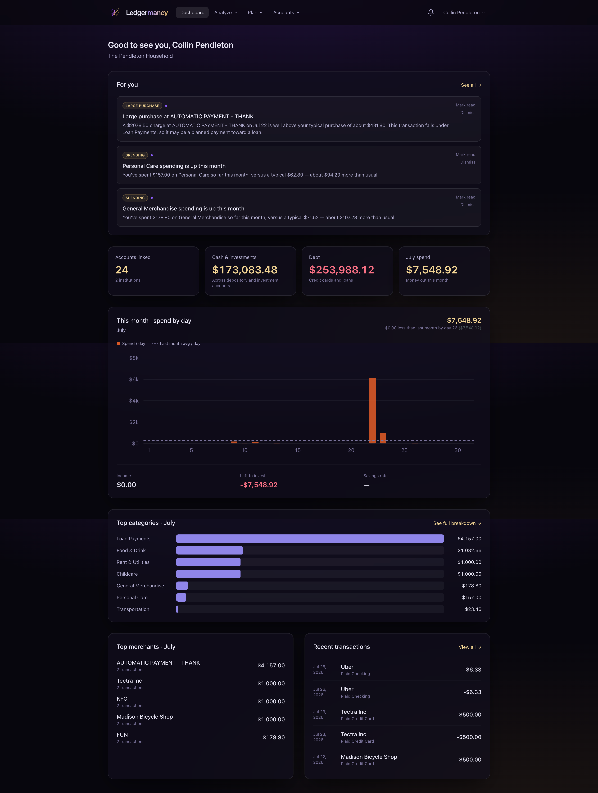
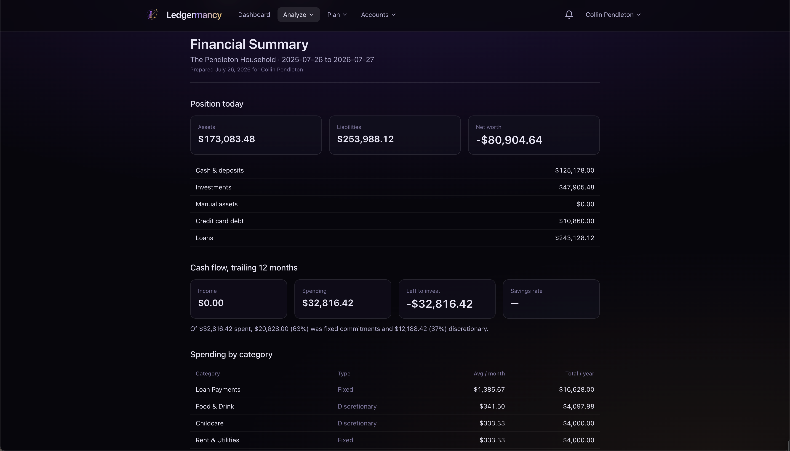
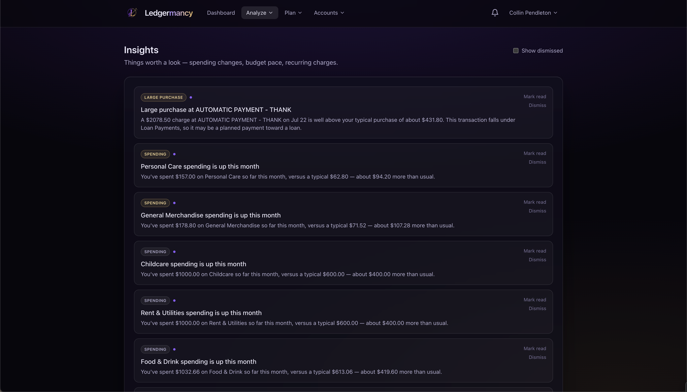
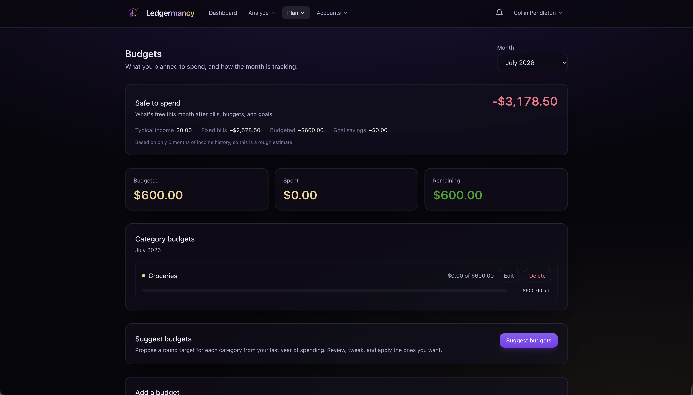
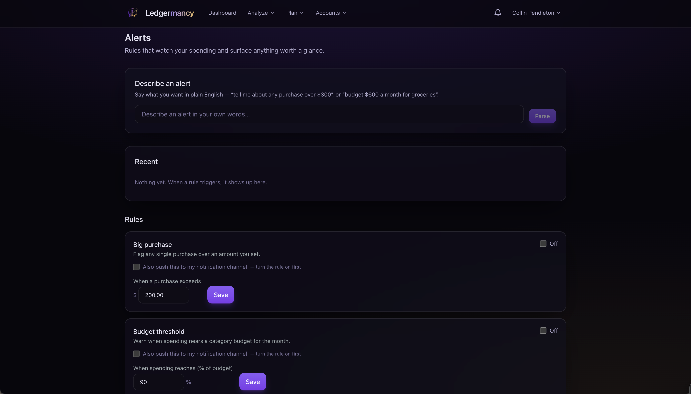

<div align="center">


# Ledgermancy

### A self-hosted, multi-user personal finance hub.

Pull your real accounts and transactions into your own Postgres database, and turn them
into the numbers you actually need — monthly spend by category, income vs.
outflow, savings rate, net worth over time, and a year-plus of history in one
place. Transactions pulled via Plaid so there's practically zero manual entering finace data needed. 

[**Docs**](https://madeofpendletonwool.github.io/ledgermancy/)
&nbsp;·&nbsp;
[**Deploy guide**](DEPLOYING.md)
&nbsp;·&nbsp;
[**Roadmap**](TODO.md)


</div>

---



## Why Ledgermancy

Most personal-finance apps fall into one of two camps: they're a cloud service
that holds your transaction data hostage, or they're a spreadsheet that makes
you do all the math. Ledgermancy is neither.

- **It's yours.** Self-hosted, single Docker Compose stack. Your transactions,
  balances, and net-worth history live in *your* Postgres — not a vendor's
  database you can never export.
- **The numbers are honest.** Money is never a float: every figure is computed
  in exact decimal inside Postgres, never in JavaScript. Credit-card payments
  are transfers, not spending, so a dollar spent on credit isn't counted twice.
  Monthly averages divide by elapsed months, not months touched. See
  [Concepts](https://madeofpendletonwool.github.io/ledgermancy/concepts/) for
  every rule that keeps the totals correct.
- **It's a household, not a single login.** Invite your spouse; share the
  institutions you want to share and keep the rest private. Per-institution
  sharing, per-user goals, a combined household view.
- **AI is optional and stays out of the way.** Leave the key blank and
  everything works on deterministic rules. Add an
  Anthropic-compatible provider (GLM, Claude, …) and you get an LLM
  categorisation fallback, a proactive insight feed, a natural-language budget
  & alert parser, a monthly recap, and a chat assistant that answers questions
  by querying your real data — not by guessing.
- **Your paperwork lives here too.** An encrypted **document vault** for
  receipts, tax returns, warranties, policies and contracts — sealed with your
  own key, attached to the transactions, assets and goals they explain, and
  nudging you before a warranty or a policy runs out. The thing a cloud
  competitor structurally cannot offer.
- **It's private by design.** Optional TOTP two-factor, server-side sessions,
  encrypted-at-rest credentials and documents, rate limiting, a security audit
  log, and invite-only registration. The app sends no email and phones home to
  nothing but Plaid and (optionally) your AI provider — plus, only if you switch
  them on, a daily index-price fetch for the Investments page's benchmark chart
  (`BENCHMARK_PRICES_ENABLED`), receipt OCR through your AI provider
  (`DOCUMENTS_OCR_ENABLED`), and an S3 bucket you nominate for document storage.
  All three are off by default.

## Features

<table>
  <tr>
    <td width="50%" align="center"><br><b>Dashboard</b><br>At-a-glance month: spend and pace, top categories, top merchants, recent activity.</td>
    <td width="50%" align="center"><br><b>Spending</b><br>By category, fixed vs. discretionary split, 12-month income vs. spending, recurring & subscriptions, a typical-month table, and an optional plain-English recap.</td>
  </tr>
  <tr>
    <td width="50%" align="center"><br><b>Net worth</b><br>Daily-snapshotted trend, asset & liability breakdown, holdings with gains, debt with rates, and manual assets Plaid can't see (home, car).</td>
    <td width="50%" align="center"><br><b>Financial Summary</b><br>A one-click, print-styled trailing-twelve-month report — position, cash flow, per-category averages, month-by-month, debt, and a labelled projection. Export to PDF or CSV.</td>
  </tr>
  <tr>
    <td width="50%" align="center"><br><b>Insights</b><br>The app noticing things: spending spikes, budget pace, new recurring charges, price creep, subscriptions — surfaced in-app and in an optional digest.</td>
    <td width="50%" align="center"><br><b>Assistant</b><br>Ask about your money in plain English. Every figure comes from your own data via tool calls — auditable, not hallucinated.</td>
  </tr>
  <tr>
    <td width="50%" align="center"><br><b>Budgets & Goals</b><br>Weekly / monthly / yearly budgets with rollover, a "safe to spend" figure, suggested budgets from your history, and savings goals that track to a target date.</td>
    <td width="50%" align="center"><br><b>Alerts</b><br>Rules that watch for you: big purchases, budget thresholds, new merchants, low leftover. Opt in to push per rule.</td>
  </tr>
</table>

Plus **Accounts** (Plaid linking, per-institution history spans, sharing, sync),
**Transactions** (multi-account + category filtering, CSV import, inline
recategorise with "apply to all from this merchant"), **Categories**
(spending / income / transfer typing, fixed-cost flags, custom colours), and
**Documents** (an encrypted vault for receipts, tax returns, warranties and
policies, attachable to any transaction, asset or goal, with expiry reminders).

And three forward-looking surfaces: **Schedule** (recurring obligations, a bill
calendar, day-by-day projected balances), **Investments** (time- and
money-weighted returns, allocation, dividends, holdings), and **Retirement** —
account-aware projections where a 401(k), a Roth and a 529 each compound on
their own terms, with contribution limits applied, an FI age, and the
assumptions that produced every figure kept on screen beside it.

It also **installs to your phone**. Ledgermancy is a PWA: add it to a home
screen and it runs standalone, opens without a network, and re-renders the last
figures it fetched — always under a banner stating the time they were saved,
and always read-only, because a stale balance shown as a live one is worse than
an error.

Full, per-feature walkthroughs live in the
[docs](https://madeofpendletonwool.github.io/ledgermancy/).

## Quick start

You'll need Docker — the whole app runs in containers, frontend included.

```bash
cp .env.example .env

# Generate the two required secrets and paste them into .env
openssl rand -base64 32   # -> ENCRYPTION_KEY
openssl rand -base64 32   # -> SESSION_SECRET

docker compose up --build
```

This brings up the full stack — Postgres, the Go API, the background worker,
**and** the frontend (nginx serving the SPA and reverse-proxying `/api`).
Migrations run automatically on API startup. The frontend is the published
edge; check health through it:

```bash
curl http://localhost:8081/healthz   # -> {"status":"ok","db":true}
```

Open **http://localhost:8081**. The first account you create becomes the
household; everyone after that joins by invitation from the Settings → Household
page. Once signed in, use **Accounts → Connect an account** to link a bank
through Plaid Link.

In Plaid's sandbox, Plaid Link accepts the test credentials `user_good` /
`pass_good`.

### Going to real accounts

You do **not** need full Plaid Production approval. A free, auto-approved
**Trial plan** gives real production data for up to 10 institutions, including
Transactions, Investments, and Liabilities. See the
[**Deploy guide**](DEPLOYING.md) for the whole path: Plaid Trial signup, server
deployment, TLS, webhooks, and backups.

> **One-way door worth knowing:** Plaid caps transaction history at 90 days by
> default and the window **cannot be changed after an Item is linked**.
> Ledgermancy requests the 730-day maximum at link time, but an institution
> linked by older code is stuck — unlink and relink to fix it.

## The stack

| Layer    | Choice                                                              |
| -------- | ------------------------------------------------------------------- |
| Backend  | Go — chi, pgx, sqlc, goose, River (background jobs)                 |
| Database | PostgreSQL 17 — money as `NUMERIC(20,4)`, raw Plaid in `JSONB`      |
| Frontend | React + Vite + TypeScript, Tailwind, shadcn/ui, Tremor, Framer Motion |
| Data     | Plaid — Transactions, plus optional Investments and Liabilities     |
| AI       | Any Anthropic Messages API-compatible endpoint (GLM, Claude, …)     |
| Deploy   | Docker Compose                                                      |

## Why the numbers are trustworthy

These rules decide every figure the app reports — getting them wrong is how
finance apps quietly lie. (Full detail in
[Concepts](https://madeofpendletonwool.github.io/ledgermancy/concepts/).)

- **Money is never a float.** `NUMERIC(20,4)` in Postgres, `shopspring/decimal`
  in Go, decimal **strings** over the wire. Every total is computed server-side.
- **Transfers are excluded from income and spending**, and **credit-card
  payments are transfers** — counting the payment would double-count every
  dollar spent on credit.
- **A manual category is sticky.** Plaid can never overwrite a choice you made.
- **Monthly averages divide by elapsed months**, not months touched.
- **Deterministic before AI.** Categorisation tries manual → household rule →
  merchant cache → Plaid's category, and only then (optionally) an LLM whose
  answer is cached so it's never paid for twice.

## Documentation

The full documentation site covers every feature, the deployment path, the
money rules, the security model, the configuration reference, and the HTTP API:

**→ https://madeofpendletonwool.github.io/ledgermancy/**

## Contributing

This is a small, opinionated app. If you'd like to work on it, read
[TODO.md](TODO.md) for the current state and known gaps, and the
[Development](https://madeofpendletonwool.github.io/ledgermancy/development/)
docs for repo layout, build/test commands, and the load-bearing invariants.

## License

GNU General Public License v3.0. See [LICENSE](LICENSE).
