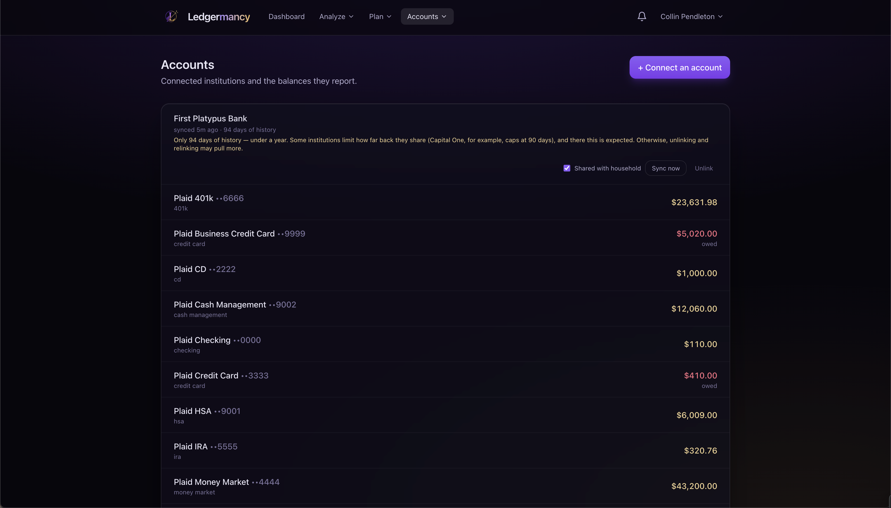

# Accounts & Plaid

<em>Connected institutions and the balances they report.</em>

Accounts is where you connect banks through Plaid, see what came in, and control
sharing.

## Connecting an account

**Connect an account** opens Plaid Link. On success, Ledgermancy:

1. Exchanges the public token for an access token (encrypted at rest with
   AES-GCM, never returned to the browser).
2. Requests the **730-day maximum** transaction history at link time.
3. Backfills until `has_more` is false, then enters the recurring sync loop
   (driven by webhooks and a worker sweep).

The first account you register creates the household; after that, registration
is invite-only. See [Households](households.md).

## Per institution

Each institution card shows:

- Name and **last synced** time.
- Whether a **backfill is still importing**.
- **Days of history** that landed — with a note if it's under a year (some
  institutions, like Capital One, cap at 90 days and that's expected).
- A **status badge** (`Reconnect required`, etc.) when the item needs attention.

### Controls

- **Shared with household** — toggle per institution. Sharing is per-institution
  so one spouse can keep an account private while everything else rolls up to
  the household. See [Households](households.md).
- **Sync now** — refresh immediately (routine syncs run in the worker).
- **Unlink** — deletes the institution's accounts and transactions (a database
  cascade). A sync summary appears after a manual sync: added / updated /
  removed across N accounts.

!!! danger "Unlinking deletes history"
    Because the cascade removes transactions, unlink is only for when you truly
    want the history gone. There is no undo. See
    [Deployment → What happens after 730 days](../deployment.md#what-happens-after-730-days).

## Per-institution products

`PLAID_PRODUCTS` sets what *new* links request; each item stores its own list,
and the Investments and Liabilities sync modules are no-ops for items not linked
with them. So an institution connected for transactions alone is completely
unaffected by either module.

!!! tip "Keep `PLAID_PRODUCTS=transactions` unless you specifically want more"
    Plaid narrows the institution list to banks supporting *every* requested
    product, so asking for all three hides banks that would otherwise work. Add
    `investments` and `liabilities` only when you actually want them.

## Sandbox credentials

In sandbox, Plaid Link accepts the test credentials `user_good` / `pass_good`.
Sandbox institutions only generate about 90 days of transactions — a fixture
limit, not a backfill limit. See [Getting started](../getting-started.md).
