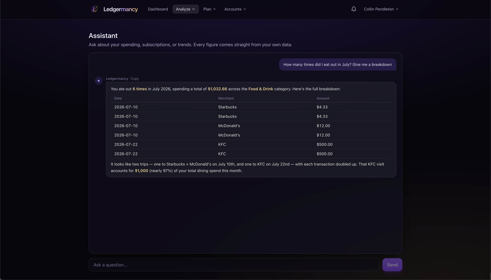

# Advisor

<em>The chat is one region of a larger Advisor surface — a briefing, ranked
options, an allocation planner, and a likelihood layer around it.</em>

The Advisor is a meeting with a deterministic financial engine that happens to
speak English. The old Assistant was a reactive chatbot with twelve
transaction-flavoured tools, each answering a past-tense question. The Advisor
keeps that chat and builds the rest of an advisor relationship around it: a
**Briefing** that opens every visit, **ranked options** for surplus cash, a
**bucket allocator**, a **likelihood layer**, saved **Threads**, and an
**action-items** tray.

It only appears when a provider is configured (`AI_API_KEY`). Leave the key
blank and the deterministic surfaces — Briefing, Options, Horizon, allocator,
likelihood — still render with plain figures and no narration.

## How it answers

The Advisor uses **tool-calling over read-only, household-scoped queries —
not RAG.** The model gets tools like `spend_by_category(month, scope)`,
`transactions_search(filters)`, `budget_status(month)`, `retirement_projection`,
and `allocation_plan`, each backed by an existing query scoped to your household
visibility. It composes an answer from real query results.

This is materially more accurate and auditable than embedding retrieval for
financial questions, and it reuses the reporting layer that is already correct.
The model never sees raw rows it didn't ask for, and every figure is one a
report could reproduce.

!!! info "Visibility is always scoped"
    Every tool inherits the same `WHERE u.household_id = $1 AND (i.user_id = $2
    OR i.is_shared)` shape the rest of the app uses. A tool that forgot this
    would leak a spouse's private account — so the scoping is enforced in the
    tool layer, not left to each caller.

## The rule the whole surface honors

**AI never computes; it interprets.** Detection, aggregation, arithmetic, and
ranking stay in SQL and `shopspring/decimal`; the model is used only for
language. Every figure it is handed is a finished `StringFixed(2)` string. The
chat system prompt forbids model-generated arithmetic outright, and that
prohibition extends to every new tool — the model quotes figures verbatim and
never reorders a ranked list.

## The Briefing

A deterministic, no-AI summary that opens the page: net worth, this month's
safe-to-spend, FI age, the household's **debt-free date**, emergency-fund runway
(months of trailing spend covered), and the top three "worth your attention"
items from the insight feed. The model may phrase the one-paragraph summary; the
fields are finished before the model sees them.

The debt-free date is the **max** over every debt's payoff — a household is
debt-free when the *last* one dies, not the first. A debt whose payoff is
"never" (payment at or below interest) makes the whole date "never".

## Ranked options for surplus cash

When safe-to-spend clears a meaningful threshold, the Advisor offers ranked,
deterministic options for it — "if you don't spend this, here is what it would
do." The ranking is a published **waterfall**, the same for every household:

1. **Starter emergency fund** — until one month of trailing fixed costs is in
   liquid savings, that is the only option offered.
2. **Unclaimed employer match** — instant guaranteed 50–100% return, and it
   expires with the tax year.
3. **Debt above a hurdle** — the hurdle is the household's own assumed real
   return, floored at 6%. Above it, a guaranteed return genuinely beats an
   assumed one.
4. **Full emergency fund** to the household's target months.
5. **Expiring tax-advantaged headroom** for the current tax year.
6. **Goal acceleration**, highest shortfall-against-target-date first.
7. **Debt below the hurdle and taxable investing**, presented side by side as a
   tradeoff — the app has no opinion on 3.5% guaranteed versus 7% assumed, and
   does not pretend to.

Slack is the Budgets page's own `reporting.BuildSafeToSpend` figure
(bill-aware when obligations are in view), never recomputed. Each option's
arithmetic is expandable into a "how this was calculated" panel. Accepting an
option writes an action item; nothing is ever executed — no transfers, no
payments, ever.

## The bucket allocator

The thing a real advisor does that the app otherwise couldn't: split a lump
sum and/or a monthly surplus across **Roth / 529 / brokerage / debt / emergency
fund** with per-bucket projection, contribution-cap enforcement, goal-mapping,
cash-drag detection, and a four-year college drawdown.

The defining rules:

- **A cap is not permission.** `AnnualLimitFor` returns the annual cap for an
  account type; a Roth IRA also has a MAGI phase-out, and a household over it
  is shown $0, not $7,500. Eligibility is reported per bucket (`eligible` /
  `phased_out` / `ineligible` / `unknown`), and a missing MAGI is `unknown`,
  never silently "eligible."
- **A plan never mutates real data.** It operates on a copy of the baseline.
- **College is four years of spending, not a bill on the first day.** A 529 is
  modelled as a drawdown — each year's cost inflated separately, the remainder
  compounding between them — and the count is per goal (community-college
  transfers and five-year programmes exist).
- **Cash-drag is measured against your own best rate**, never a bundled or
  fetched one, and stays silent if no `deposit_apy` is on file.

Saved plans are schema-versioned and recomputed against the live baseline on
every open — a saved projection is a figure that quietly stops being true.

## The likelihood layer

For any saved plan, a Monte Carlo simulation produces P10 / P50 / P90, a
success rate (the share of simulated futures that meet the target), and a P5
peak-to-trough drawdown. Comparing several plans at once runs a documented
**guardrail** rule — filter by the household's drawdown floor, keep the plans
that meet every goal at the median outcome, then sort by success rate — and
names a top pick in those terms, or "no pick" when every plan breaches the
floor.

Three honesty decisions worth knowing:

- **Buckets are modelled as moving together.** A Roth, a 529, and a taxable
  brokerage largely hold the same equities; drawing them independently would
  diversify them in the model in a way they do not diversify in life, and every
  success rate would read too high.
- **Drawdown is a percentile, not a maximum.** A maximum over `n` runs gets
  monotonically worse as `n` grows; the P5 converges, so the run count can't
  flip which plan the guardrail picks.
- **There are two "P50" figures and they are labelled differently.** The
  allocator's "projected at your assumed return" and the simulation's "median
  simulated outcome" disagree by roughly `e^(−Tσ²/2)` — about 15% at typical
  inputs — because volatility drags compounding. Both are shown, with one line
  explaining the gap.

An accepted plan is **tracked**: actuals are read live and reconciled against
the plan's expected position, so editing a past contribution corrects the drift
without a migration, and a behind-plan insight fires when drift crosses a
threshold.

## Threads and action items

- **Threads** — saved conversations, household-scoped. Transcripts are sealed
  with the same AES-GCM cipher as Plaid tokens and document bytes, and each
  assistant turn carries its tool results so a reloaded thread re-renders its
  figures and charts with provenance. Figures in history are context, never
  current — the replay rule.
- **Action items** — the advisor proposes, you accept, and it is tracked
  (never executed). Items can come from an option, an allocation plan, a
  thread, or be added manually.

## Suggestions

The empty state offers high-value prompts that show what the advisor is
*actually* good at — dynamic, one-off questions the dashboard can't answer at a
glance:

- "How many times did I eat out in July? Give me a breakdown"
- "Is my dining spending up vs last month?"
- "What should I do with $30k sitting in savings?"
- "Will my current plan let me retire at 60?"

## Disabling

If `AI_API_KEY` is blank, the page explains that a provider is needed for the
chat and the nav item is hidden, but the deterministic Briefing, Options,
allocator, and likelihood surfaces still render with plain figures. See
[Configuration → AI](../configuration.md#ai-provider).

## Provider

The provider is any **Anthropic Messages API-compatible endpoint** — GLM,
Claude, or anything else speaking that wire format — selected via a configurable
base URL. Nothing is hardcoded to `api.anthropic.com`.

---

The four plan docs behind this page —
[24-proactive-advisor](../plans/24-proactive-advisor.md),
[31-advisor-surface](../plans/31-advisor-surface.md),
[32-allocation-planner](../plans/32-allocation-planner.md), and
[33-likelihood-layer](../plans/33-likelihood-layer.md) — each carry Shipped
notes correcting the plan against the code.
