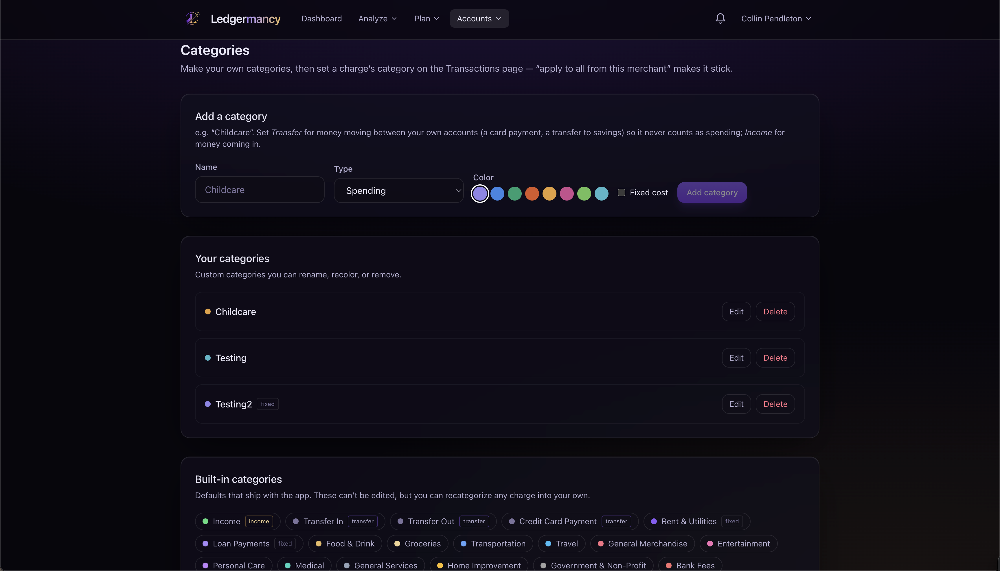

# Categories

<em>Custom categories, typed spending / income / transfer, with colours.</em>

Categories is where you define your own categories and decide how each one
counts. Categorisation drives every spending and income figure, so getting the
typing right matters — see [Concepts → Categorisation
order](../concepts.md#categorisation-order).

## Category types

Every category is one of three types. This is the lever that fixes a category
that was wrongly inflating your spend:

| Type | Counts as | Use for |
| --- | --- | --- |
| **Spending** | Money out | The default — groceries, dining, etc. |
| **Income** | Money in | Paychecks, refunds, side income |
| **Transfer (not spending)** | Neither | Money moving between your own accounts |

A **transfer** is money between your own accounts — a card payment, a move to
savings. It is excluded from spending entirely, which is the fix for
credit-card payments and self-transfers showing up as spend. See [Concepts →
Transfers & credit-card payments](../concepts.md#transfers-credit-card-payments).

## Fixed cost

A spending category can be flagged **fixed cost** (rent, utilities, loan
payments). That flag drives the fixed-vs-discretionary split in
[Spending](spending.md) and the [Report](report.md).

## Adding and editing

- **Add a category:** name, type, colour (from a preset palette), and the
  fixed-cost flag (spending only).
- **Edit:** rename, recolour, retype, or toggle fixed.
- **Delete:** confirm first; its charges become uncategorised.

!!! warning "Changing a category's type re-classifies history"
    Switching a category from spending to transfer re-classifies every
    transaction already on it, so spending/income figures refresh app-wide.

## Built-in categories

Defaults that ship with the app (shown read-only below your custom ones). They
can't be edited, but you can recategorize any charge into your own. The built-in
transfer categories are shown so you don't accidentally duplicate them.

## Applying categories

You don't set categories here — you set them on the [Transactions](transactions.md)
page. Tick **All from {merchant}** to make a choice stick for future syncs and
fix every existing charge from that merchant at once.
