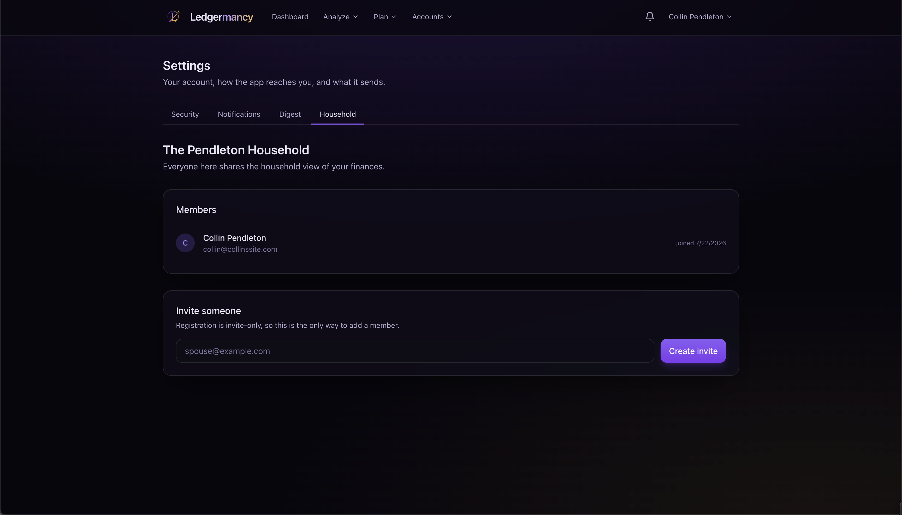

# Households

<em>Settings → Household: members and invites.</em>

Ledgermancy is built around a **household**: the first account you register
creates it, and everyone after joins by invitation. This keeps the app a private
ledger rather than an open sign-up form on the public internet.

The Household tab lives under **Settings** (old `/household` links redirect
there).

## Members

The members list shows everyone in the household. The first member is the
household's creator.

## Invites

To add someone:

1. **Create an invite** — returns a one-time token **once**.
2. Send the link to the person.
3. They register with it and join the household.

- An invite is **bound to the address it was issued for**, so an intercepted
  link cannot be redeemed under a different email.
- Pending invites are listed and can be **revoked** before they're used.

## Visibility & sharing

What each member sees follows one rule: **your own items ∪ household items where
`is_shared`**. Every query in the app uses the same shape.

Sharing is controlled **per institution** on the [Accounts](accounts.md) page —
the **Shared with household** toggle on each institution card. This lets one
spouse keep an account private while everything else rolls up to the household.

| Setting | Scope | Effect |
| --- | --- | --- |
| Shared institution | Institution | All its accounts visible to the household |
| Personal goal | Goal | Tracks for the user only, not the household |

Goals can be marked **Just for me** at creation to make them personal rather
than household-scoped.

## Removing a member

Revoke a member's sessions from the [Security](../security.md) page if needed;
household membership itself is managed here. Because an invite is address-bound
and sessions are server-side, there's no client-side loophole for leftover
access.
