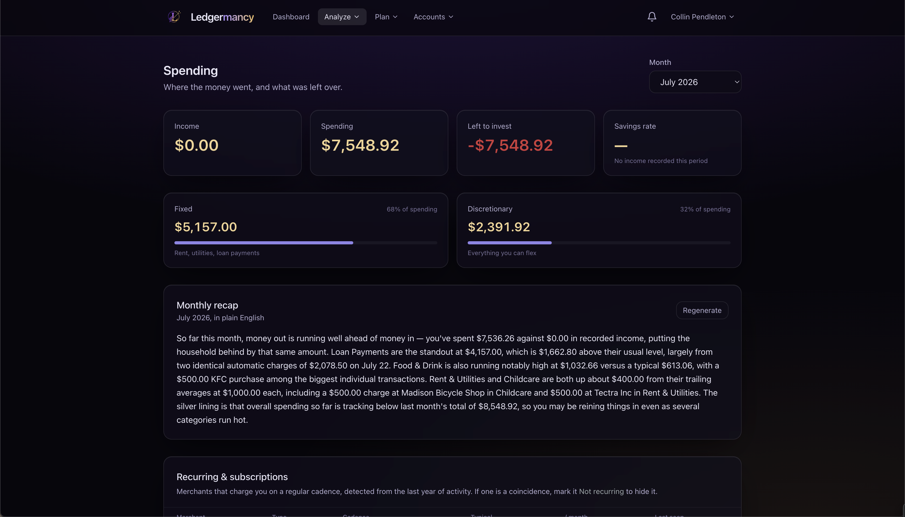

# Spending

<em>Where the money went, and what was left over.</em>

Spending is the full breakdown of where your money goes. Pick a month at the top
and every figure on the page recalculates.

## Headline numbers

Four tiles for the selected month:

- **Income** — the negation of rows in income categories.
- **Spending** — positive rows in spending categories.
- **Left to invest** — income minus spending (red if negative).
- **Savings rate** — leftover ÷ income.

If there's no income recorded in the period, the savings rate shows a hint
rather than dividing by zero.

## Fixed vs. discretionary

When there is spending, two tiles split it:

- **Fixed** — rent, utilities, loan payments. Driven by the `is_fixed` flag on
  categories (see [Categories](categories.md#fixed-cost)).
- **Discretionary** — everything you can flex.

Each shows its share of total spending as a percentage.

## By category

A bar chart of spending by category for the month. **Click a bar** to open those
transactions filtered to that category and month.

## Income vs. spending

A 12-month trailing trend chart of income against spending, so you can see the
shape of your year.

The chart can be switched into **real (inflation-adjusted) dollars**, which is
where deflation earns its keep most plainly: a multi-year nominal spending trend
shows a household spending more every year even when it is buying less every
year. Nominal is the default. See
[Real dollars and nominal dollars](../concepts.md#real-dollars-and-nominal-dollars).

## Typical month

A table of every category with its **average per month** and **total per year**
over the last year, plus transaction count. Fixed categories are badged. This is
the table that matters for planning.

## Recurring & subscriptions

A table of merchants that charge you on a regular cadence, **detected from the
last year of activity**:

| Column | Meaning |
| --- | --- |
| Merchant | Who charges you |
| Type | *(AI only)* subscription classification |
| Cadence | weekly / monthly / yearly / etc. |
| Typical | The usual charge amount |
| ~/month | Normalised to a monthly figure (computed server-side) |
| Last seen | The most recent charge |

- A **price up** badge appears when a merchant's charge has crept up (sourced
  from the insight feed).
- If a detected "recurring" charge is a coincidence, click **Not recurring** to
  hide it. Hidden merchants appear as chips at the bottom and can be restored
  with the **×**.

!!! note "All amounts are server-computed"
    The monthly estimate and typical amount are computed exactly in SQL — never
    summed in the browser. See [Concepts](../concepts.md).

## Monthly recap *(AI)*

When AI is enabled, a **Monthly recap** card appears. It writes a plain-English
summary of the month on demand and caches it server-side. Click **Generate** (or
**Regenerate**) to produce one.

> The recap is on the roadmap for an overhaul — formatting money, feeding the
> model a real per-category breakdown, and auto-generating on a schedule. See
> [Roadmap](../roadmap.md).
