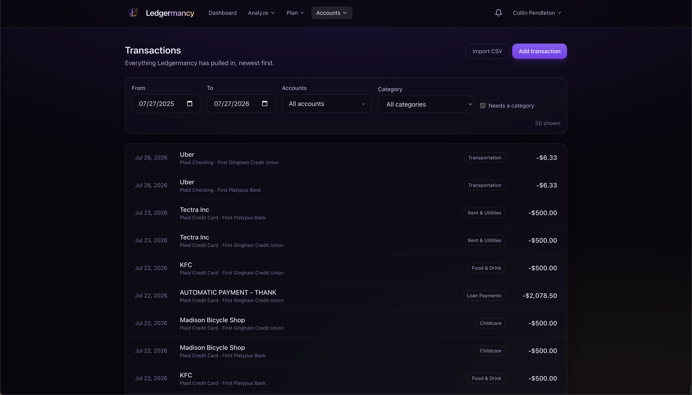

# Transactions


<em>Everything Ledgermancy has pulled in, newest first.</em>

Transactions is the ledger: everything the app has pulled in from Plaid plus
anything you've added by hand, newest first.

## Filtering

Filters live in the **URL**, so the Dashboard and Spending charts can deep-link
into a filtered view (one day, one category) and the browser back button
restores it. There is no separate local filter state to keep in sync.

| Filter | Notes |
| --- | --- |
| **From / To** | Defaults to a rolling year |
| **Accounts** | Multi-select, grouped by institution. Empty = all accounts. |
| **Category** | Single-select, includes all categories |
| **Needs a category** | Show only uncategorised rows — handy for a cleanup pass |
| **Search** | A composable query — see [Search](#search) below |

Changing any filter (except an explicit page move) resets to page 0, so a new
filter never lands you past the end of a now-shorter result set. Paging keeps
the previous page on screen while the next loads.

**Per page** sits beside the pager and offers 50, 100, 200 or 500 rows. It lives
in the URL like every other filter, and changing it takes you back to page 1 —
page 7 of fifties is not page 7 of five-hundreds.

## Acting on several rows at once

**Select** (top right) reveals a checkbox on every row. It is off by default, and
off again the moment you press **Done**: a ledger is something you read far more
often than something you act on in bulk, so the default row keeps every pixel for
the merchant name.

Tick rows individually, shift-click to take a range, or use the checkbox in the
header strip to take the whole page. A bar appears at the bottom with the actions
that make sense over a set:

| Action | Notes |
| --- | --- |
| **Tags** | Tick tags, then **Add** or **Remove**. Adding never strips labels already on a row. |
| **Category** | One category for everything selected. Recorded in each row's history, as a single recategorise is. |
| **How it counts** | Mark as one-time / treat as usual, and exclude from / include in reports. |

There is no bulk delete. The actions offered are the ones that are reversible or
safely re-appliable; deleting is neither, so it stays a one-row decision in the
row's own ⋯ menu.

The selection covers **the rows currently on screen** and is dropped whenever the
result set changes — a different filter, page or page size. It deliberately
survives an action, so "tag these, now categorise the same ones" is two clicks
rather than two selections. Each action reports how many rows it actually
changed, which can be fewer than you selected: re-applying a tag that is already
there changes nothing.

## Search

The search box takes a **composable query**: type a word to search, or add
`key:value` terms to narrow it. Every term is ANDed, and a leading `-` excludes.

```
starbucks over:10 since:-30d
has_no_category -account:Checking
merchant_starts:AMZN under:25 is_expense
category:groceries since:start-of-this-month
```

A bare word searches the merchant name and description, which is all this box
used to do — old links and bookmarks keep working. The filter chips still apply
on top, so nobody has to learn the grammar to use the page. Start typing and the
box suggests the operators the word could become; **what can I type?** lists
worked examples you can click to run.

### Text operators

Each of these has four varieties: `merchant:x` (contains, the default),
`merchant_is:x`, `merchant_starts:x` and `merchant_ends:x`.

| Operator | Matches |
| --- | --- |
| `merchant` (`payee`) | The canonical merchant name, the name the bank sent, and the descriptor key |
| `description` (`desc`) | The raw description on the row |
| `notes` | Notes you have written |
| `account` | Account name |
| `institution` (`bank`) | Institution the account belongs to |
| `category` (`cat`) | Category name or slug |
| `currency`, `source` | Exact by default — `source:manual`, `currency:USD` |

Quote a value with spaces: `account:"Joint Checking"`.

### Dates

`since:` (`after`, `from`), `before:` (`until`, `to`) and `on:` (`date`). Both
bounds are **inclusive**, so `since:X before:Y` is the closed range it looks
like. Values take three shapes:

| Shape | Examples |
| --- | --- |
| Keyword | `today`, `yesterday`, `start-of-this-month`, `end-of-last-year`, `start-of-this-week` |
| Relative | `-30d`, `-6m`, `-1y`, `+7d` — no sign means the past |
| Absolute | `2026-01-01` |

Keywords also accept spaces (`since:"start of this month"`) or underscores.

!!! info "A date term overrides the From / To pickers"
    The page always sends a date window, so ANDing it with `since:2019-01-01`
    would silently clip the search to the last year and answer "nothing found"
    for a perfectly good query. Naming a date in the query hands it the whole
    window instead. Every other kind of term still narrows within From / To.

### Amounts

`amount:10`, `over:10` (`amount_more`) and `under:10` (`amount_less`). These
compare the **magnitude**, ignoring sign — a $2,500 paycheck and $2,500 of rent
are both `over:2000`. Pair with `is_expense` or `is_income` for direction.

### Flags

Written on their own, with no value. Each has a negative spelling, and a leading
`-` works too.

| Flag | Negative |
| --- | --- |
| `has_category` | `has_no_category` |
| `has_notes` | `has_no_notes` |
| `has_attachment` | `has_no_attachment` |
| `has_split` | `has_no_split` |
| `is_pending` | `is_posted` |
| `is_recurring`, `is_manual`, `is_one_time` | `is_not_recurring`, … |
| `is_expense`, `is_income`, `is_transfer` | `is_not_expense`, … |
| `is_excluded` | `is_not_excluded` |

`is_excluded` turns off the "hide rows excluded from reports" default on its own,
since otherwise it could never match anything.

An operator the parser does not know is treated as free text rather than an
error, so a pasted descriptor like `AMZN:MKTP` still finds its charge. A value it
cannot resolve (`over:banana`) is reported next to the box.

## Recategorising inline

Click a row's category chip to recategorise it inline. The dropdown shows the
app's resolved category (falling back to "Uncategorised"), not Plaid's raw
guess.

Tick **All from {merchant}** to both remember the choice for future syncs **and**
retroactively fix every existing charge from that merchant — handled
server-side. This is the fastest way to clean up a mis-categorised merchant.

!!! info "Manual choices are sticky"
    A choice you make is marked `category_source = 'manual'` and is preserved by
    the sync upsert — Plaid can never overwrite it. See
    [Concepts → Categorisation order](../concepts.md#categorisation-order).

## Split with the household

A row's **Split** button divides a charge across household members — 50/50,
custom, or by picking who it was for. This is the path for shared expenses a
single charge covers (one card, two people).

A split is an **attribution overlay**: the charge still happened once, and your
spending totals do not change when you split it. What changes is the household
ledger — who owes whom — surfaced on the [Shared](households.md#shared-expenses-and-bill-split)
page. Shares are stored as exact amounts, so they always sum to the transaction
with no rounding drift. Clear a split to take it back off.

## Add transaction

Use **Add transaction** to reconcile a charge your bank feed missed. A modal
collects account, date, amount, an Expense / Income-refund toggle (which sets
the sign), merchant/description, category, and notes.

> A manual transaction corrects your **spending totals only** — it never changes
> an account balance.

Manual rows are badged `MANUAL` and can be edited or deleted; Plaid rows stay
read-only except for category. If a manual row matches a synced charge that
later arrives, a **Possible duplicate** notice appears with a one-click delete.

## Importing a CSV


**Import CSV** opens a generic importer for backfilling history older than
Plaid's window, or for institutions that cap history. It:

- Lets you **map your bank's columns** to the fields the app needs.
- Accepts a **single signed amount** column or **separate debit/credit**
  columns.
- **De-duplicates** against synced data so you don't double-count overlapping
  ranges.
- Runs imported rows through the **same categoriser** as synced transactions.

Pick the account the CSV belongs to, map columns, preview, and confirm.
