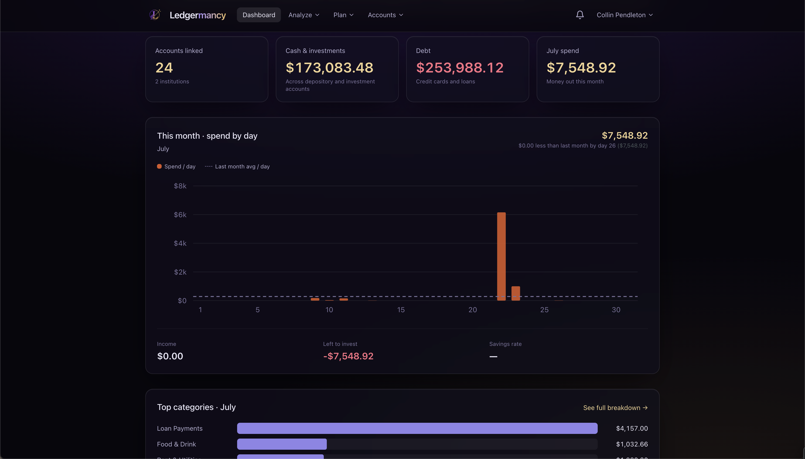
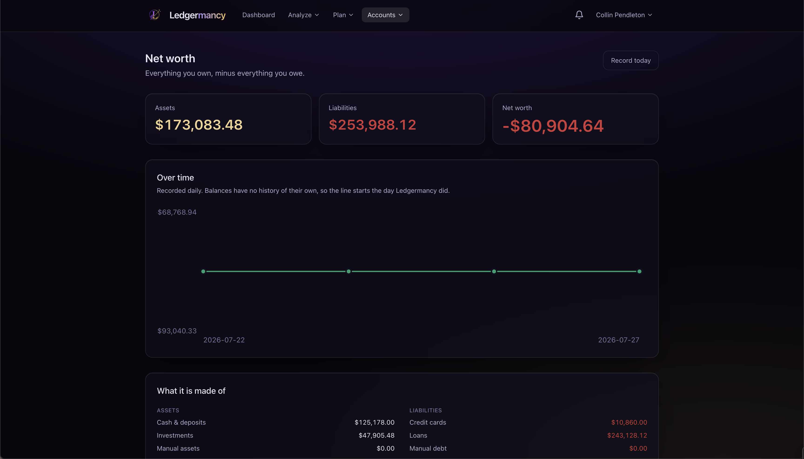

# Ledgermancy

{: style="width:420px"}

**A self-hosted, multi-user personal finance hub.**

Pull your real accounts and transactions into your own Postgres, and turn them
into the numbers you actually need — monthly spend by category, income vs.
outflow, savings rate, net worth over time, and a year-plus of history in one
place.

[Get started](getting-started.md){ .md-button .md-button--primary }
[Deploy it](deployment.md){ .md-button }
[Read the concepts](concepts.md){ .md-button }

---

## Why self-host your finances

Most personal-finance apps fall into one of two camps: a cloud service that
holds your transaction data hostage, or a spreadsheet that makes you do all the
math. Ledgermancy is neither.

- **It's yours.** Self-hosted, single Docker Compose stack. Your transactions,
  balances, and net-worth history live in *your* Postgres — not a vendor's
  database you can never export.
- **The numbers are honest.** Money is never a float: every figure is computed
  in exact decimal inside Postgres, never in JavaScript. Credit-card payments
  are transfers, not spending, so a dollar spent on credit isn't counted twice.
  See [Concepts](concepts.md) for every rule that keeps the totals correct.
- **It's a household, not a single login.** Invite your spouse; share the
  institutions you want to share and keep the rest private.
- **AI is optional and stays out of the way.** Leave the key blank and
  everything works on deterministic rules. Add a provider and you get an LLM
  categorisation fallback, a proactive insight feed, natural-language budget &
  alert parsing, a monthly recap, and a chat assistant that queries your real
  data.

## What it does

[:material-view-dashboard: Dashboard](features/dashboard.md)
:   This month at a glance — spend and pace, top categories, top merchants,
    recent activity.

[:material-chart-bar: Spending](features/spending.md)
:   Where the money went, fixed vs. discretionary, a 12-month trend, recurring &
    subscriptions, and a typical-month table.

[:material-lightbulb-outline: Insights](features/insights.md)
:   The app noticing things for you — spending spikes, budget pace, new
    recurring charges, price creep.

[:material-file-document-outline: Financial Summary](features/report.md)
:   A one-click, print-styled trailing-twelve-month report. Export to PDF or
    CSV.

[:material-wallet-outline: Budgets](features/budgets.md)
:   Weekly / monthly / yearly budgets with rollover, a "safe to spend" figure,
    and suggested budgets from your history.

[:material-target: Goals](features/goals.md)
:   Savings goals that track against a target date and tell you if you're on
    pace.

[:material-chart-line: Net worth](features/net-worth.md)
:   Daily-snapshotted trend, asset & liability breakdown, holdings with gains,
    debt with rates, and manual assets Plaid can't see.

[:material-swap-horizontal: Transactions](features/transactions.md)
:   Multi-account + category filtering, CSV import, inline recategorise with
    "apply to all from this merchant".

[:material-tag-multiple: Categories](features/categories.md)
:   Spending / income / transfer typing, fixed-cost flags, custom colours.

[:material-bank: Accounts & Plaid](features/accounts.md)
:   Plaid linking, per-institution history spans, household sharing, sync.

[:material-bell-outline: Alerts](features/alerts.md)
:   Rules that watch for you — big purchases, budget thresholds, new merchants,
    low leftover — with optional push.

[:material-robot: Assistant](features/assistant.md)
:   Ask about your money in plain English; every figure comes from your own
    data via tool calls.

## A tour

<em>The Dashboard — your month at a glance.</em>

<em>Net worth over time, snapshotted daily.</em>

## The stack

| Layer    | Choice                                                              |
| -------- | ------------------------------------------------------------------- |
| Backend  | Go — chi, pgx, sqlc, goose, River (background jobs)                 |
| Database | PostgreSQL 17 — money as `NUMERIC(20,4)`, raw Plaid in `JSONB`      |
| Frontend | React + Vite + TypeScript, Tailwind, shadcn/ui, Tremor, Framer Motion |
| Data     | Plaid — Transactions, plus optional Investments and Liabilities     |
| AI       | Any Anthropic Messages API-compatible endpoint (GLM, Claude, …)     |
| Deploy   | Docker Compose                                                      |

## Next

- **New here?** Start with [Getting started](getting-started.md).
- **Putting it on a server?** Read the [Deployment](deployment.md) guide.
- **Want to trust the numbers?** Read [Concepts](concepts.md) — the rules that
  keep every total honest.
